<div align="center">


<br/>

[](https://laravel.com)
[](https://php.net)
[](https://stripe.com)
[](https://mysql.com)
[](LICENSE)

<br/>


&nbsp;

&nbsp;


<br/><br/>

> **A full-stack e-commerce platform for gym & fitness equipment**
> Built with Laravel · Powered by Stripe · Crafted with passion

<br/>

[Live Demo](#) &nbsp;&nbsp;·&nbsp;&nbsp; [Screenshots](#screenshots) &nbsp;&nbsp;·&nbsp;&nbsp; [Quick Start](#quick-start) &nbsp;&nbsp;·&nbsp;&nbsp; [Report Bug](../../issues) &nbsp;&nbsp;·&nbsp;&nbsp; [Features](#features)

<br/>

</div>

---

<br/>

## Overview

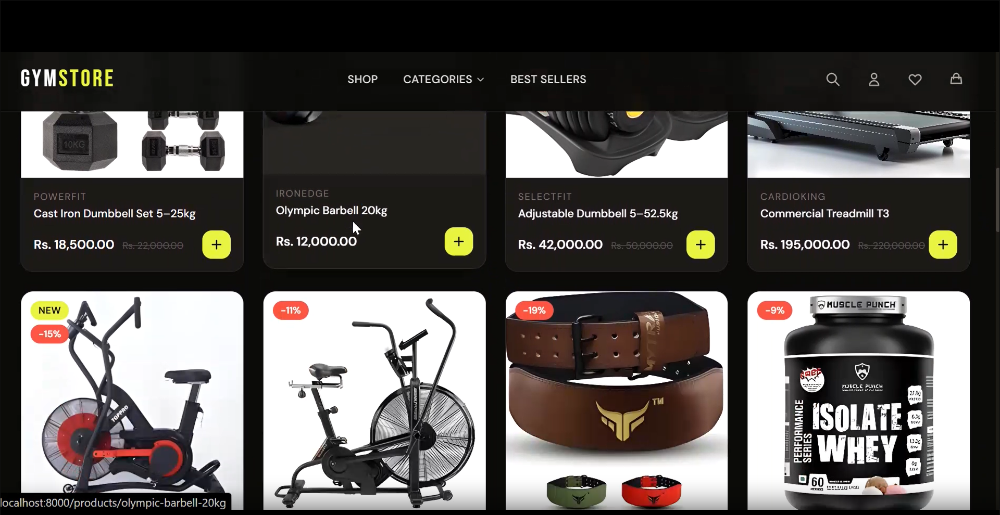

**GymStore** is a full-featured fitness equipment e-commerce platform built from the ground up using the Laravel framework. It provides a seamless shopping experience for customers and a powerful management interface for store administrators.

From browsing a rich product catalog to checking out securely with Stripe, every part of the user journey has been carefully designed and engineered.

<br/>

**Highlights at a glance:**

- Full shopping cart & wishlist system
- Stripe-powered secure checkout
- Coupon & discount code management
- User auth with email password recovery
- Feature-rich admin dashboard
- Product & inventory management
- Related products recommendation engine
- Fully responsive across all devices

<br clear="right"/>

---

<br/>

## Features

<table>
<tr>
<td width="50%" valign="top">

### Customer Experience
- Browse products with category filters
- Product detail pages with image gallery
- Related products recommendations
- Add to cart & manage quantities
- Wishlist / save products for later
- Apply coupon codes at checkout
- Stripe-secured payment processing
- Order confirmation & tracking
- User account & profile management
- Forgot password with email recovery

</td>
<td width="50%" valign="top">

### Admin Controls
- Dashboard with key metrics overview
- Full product CRUD with image uploads
- Category & subcategory management
- Order management & status updates
- Coupon creation with expiry control
- User management & access roles
- Inventory tracking
- Secure admin authentication

</td>
</tr>
</table>

---

<br/>

## Screenshots

<br/>

### Landing Page

<div align="center">
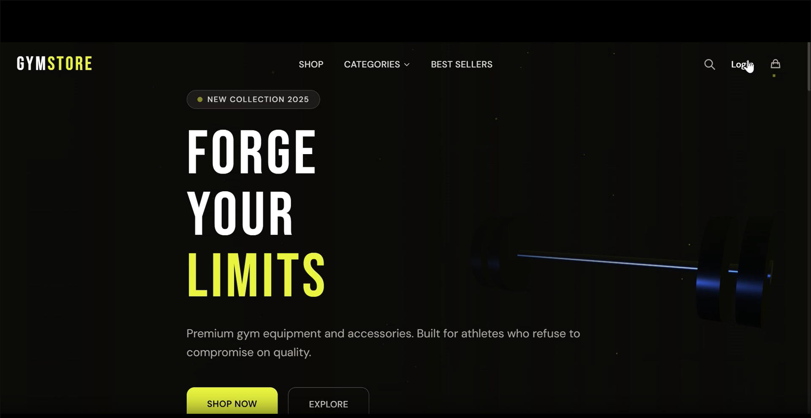
</div>

<br/>

---

### Shop & Product Pages

<div align="center">
<table>
<tr>
<td align="center" width="50%">
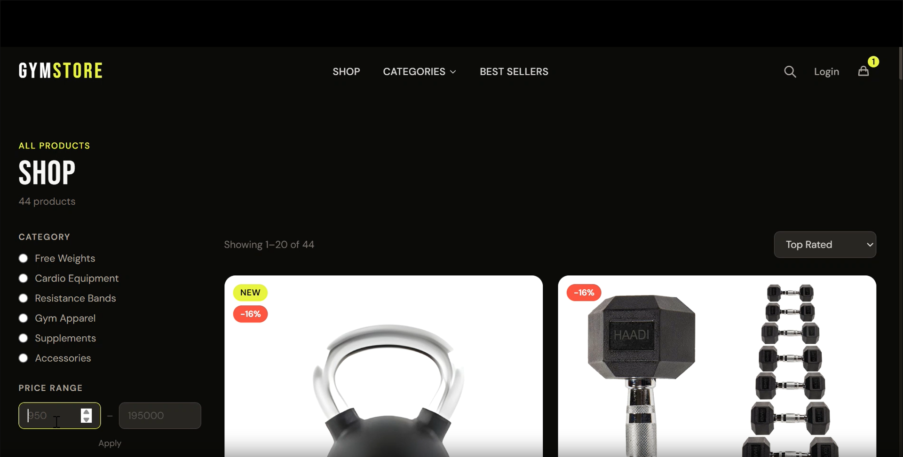
<br/><br/><b>Shop — Product Listing</b>
</td>
<td align="center" width="50%">
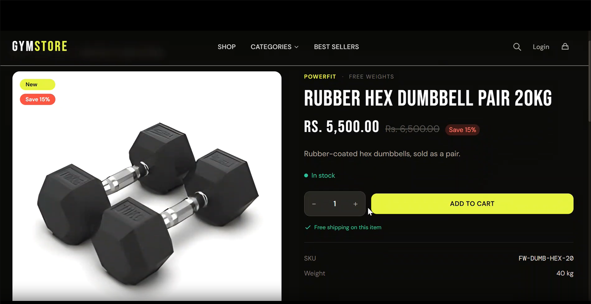
<br/><br/><b>Product Detail Page</b>
</td>
</tr>
</table>
</div>

<br/>

### Related Products

<div align="center">
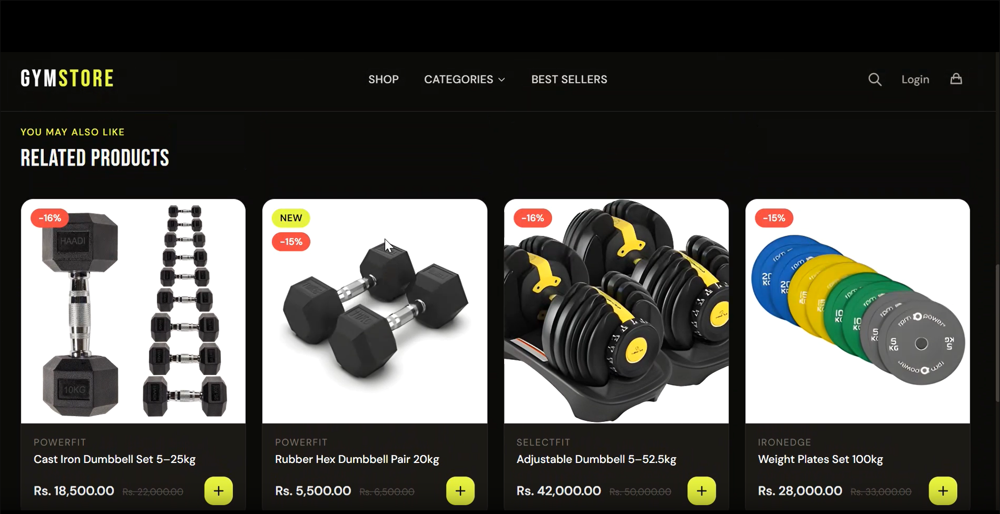
</div>

<br/>

---

### Cart & Wishlist

<div align="center">
<table>
<tr>
<td align="center" width="50%">
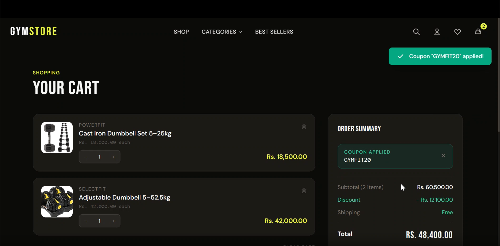
<br/><br/><b>Shopping Cart</b>
</td>
<td align="center" width="50%">
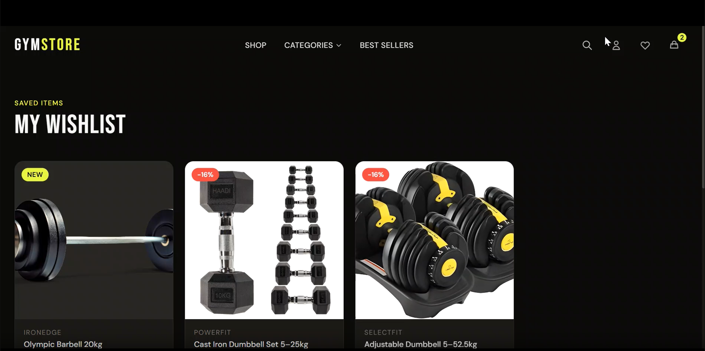
<br/><br/><b>Wishlist</b>
</td>
</tr>
</table>
</div>

<br/>

---

### Coupon System

<div align="center">
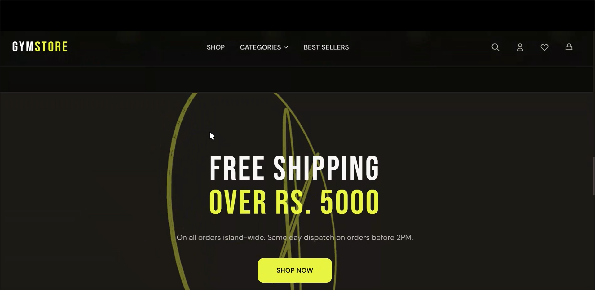
</div>

<br/>

---

### Authentication

<div align="center">
<table>
<tr>
<td align="center" width="50%">
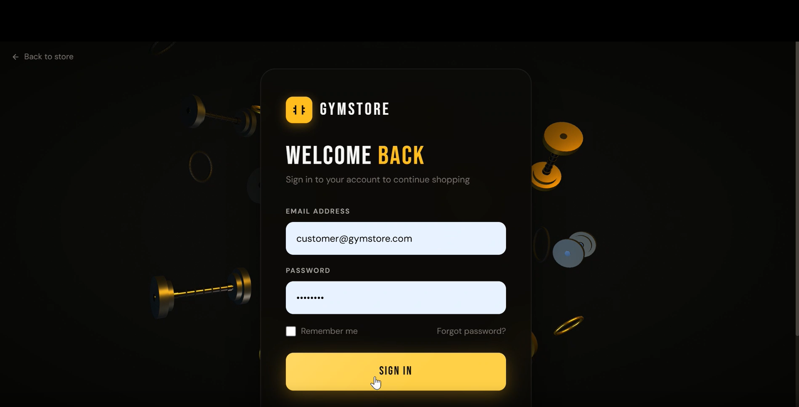
<br/><br/><b>Login</b>
</td>
<td align="center" width="50%">
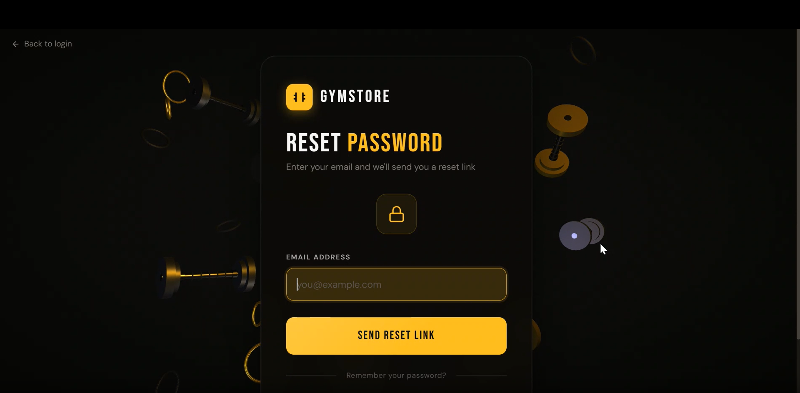
<br/><br/><b>Forgot Password</b>
</td>
</tr>
</table>
</div>

<br/>

---

### Admin Dashboard

<div align="center">
<table>
<tr>
<td align="center" width="50%">
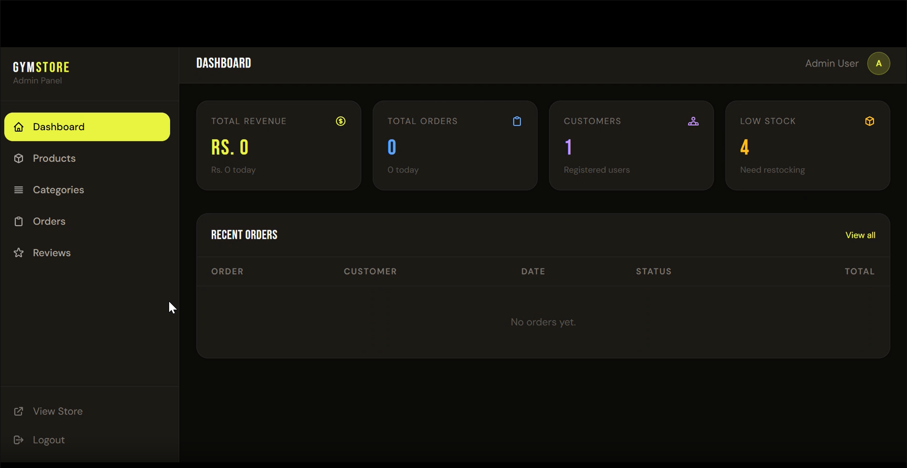
<br/><br/><b>Admin Overview</b>
</td>
<td align="center" width="50%">
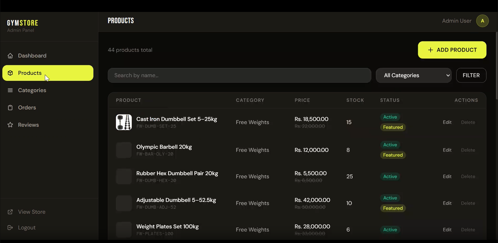
<br/><br/><b>Product Management</b>
</td>
</tr>
</table>
</div>

<br/>

---

## Tech Stack

<div align="center">

| Layer | Technology |
|:---|:---|
| **Backend** | PHP 8.x · Laravel 11 |
| **Frontend** | Blade Templates · CSS · JavaScript |
| **Database** | MySQL / PostgreSQL |
| **Payments** | Stripe PHP SDK |
| **Authentication** | Laravel Auth |
| **File Storage** | Laravel Filesystem |
| **Email** | Laravel Mail (SMTP / Mailtrap) |
| **Dev Tools** | Composer · Artisan · PHPUnit · Pint · Tinker · Sail |

</div>

---

<br/>

## Quick Start

### Prerequisites

- PHP >= 8.1
- Composer >= 2.x
- Node.js >= 18.x & npm
- MySQL database
- A Stripe account (free) — [stripe.com](https://stripe.com)

---

### Installation

**1. Clone the repository**

```bash
git clone https://github.com/krishsofttech-dev/gym-store.git
cd gym-store
```

**2. Install PHP dependencies**

```bash
composer install
```

**3. Install and build frontend assets**

```bash
npm install
npm run build
```

**4. Set up environment file**

```bash
cp .env.example .env
php artisan key:generate
```

**5. Configure your `.env` file**

```env
APP_NAME="GymStore"
APP_ENV=local
APP_DEBUG=true
APP_URL=http://localhost

DB_CONNECTION=mysql
DB_HOST=127.0.0.1
DB_PORT=3306
DB_DATABASE=gym_store
DB_USERNAME=root
DB_PASSWORD=your_password

STRIPE_KEY=pk_test_xxxxxxxxxxxxxxxxxxxx
STRIPE_SECRET=sk_test_xxxxxxxxxxxxxxxxxxxx
STRIPE_WEBHOOK_SECRET=whsec_xxxxxxxxxxxxxxxxxxxx

MAIL_MAILER=smtp
MAIL_HOST=sandbox.smtp.mailtrap.io
MAIL_PORT=2525
MAIL_USERNAME=your_mailtrap_username
MAIL_PASSWORD=your_mailtrap_password
MAIL_FROM_ADDRESS=noreply@gymstore.com
MAIL_FROM_NAME="GymStore"
```

**6. Migrate database and seed sample data**

```bash
php artisan migrate --seed
```

**7. Link storage and serve**

```bash
php artisan storage:link
php artisan serve
```

Visit **http://localhost:8000**

---

<br/>

## Stripe Setup

1. Sign up free at [stripe.com](https://stripe.com)
2. Go to **Developers → API Keys**
3. Copy **Publishable key** → paste as `STRIPE_KEY`
4. Copy **Secret key** → paste as `STRIPE_SECRET`
5. For local webhook testing, install the [Stripe CLI](https://stripe.com/docs/stripe-cli):

```bash
stripe listen --forward-to localhost:8000/stripe/webhook
```

Copy the webhook signing secret → paste as `STRIPE_WEBHOOK_SECRET`

> Test card: `4242 4242 4242 4242` — any future expiry, any CVC, any ZIP.

---

<br/>

## Project Structure

```
gym-store/
├── app/
│   ├── Http/
│   │   ├── Controllers/
│   │   └── Middleware/
│   ├── Models/
│   └── Providers/
├── database/
│   ├── migrations/
│   └── seeders/
├── resources/
│   ├── views/
│   ├── css/
│   └── js/
├── routes/
│   ├── web.php
│   └── api.php
├── screenshots/
├── public/
├── config/
├── storage/
└── tests/
```

---

<br/>

## Testing

```bash
php artisan test

php artisan test --coverage

php artisan test --testsuite=Feature
```

---

<br/>

## Production Deployment

```bash
APP_ENV=production
APP_DEBUG=false

composer install --optimize-autoloader --no-dev

npm run build

php artisan config:cache
php artisan route:cache
php artisan view:cache
php artisan optimize

php artisan migrate --force
```

<br/>

## License

Distributed under the **MIT License** — see the [LICENSE](LICENSE) file for full details.

---

<br/>

<div align="center">

*Designed and built by [krishsofttech-dev](https://github.com/krishsofttech-dev)*

<br/>


**Star this repo if you found it helpful!**

<br/>

`Designed and built by krishsofttech-dev`

</div>
